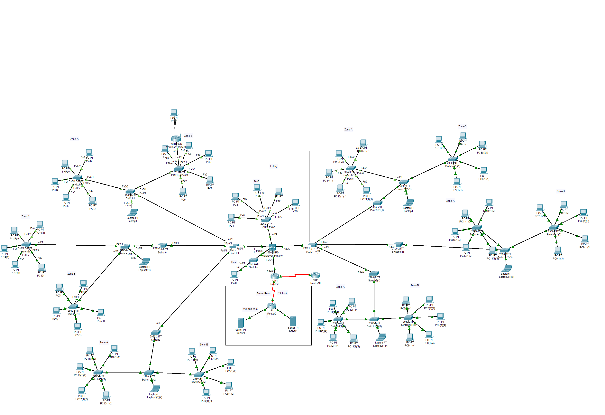

# California Love Hotel - Network Topology Design

**Team:** 3 members  
**Year:** 2025  
**Tool:** Cisco Packet Tracer

---

## Overview

Designed and simulated a multi-building hotel network with 60+ devices, 5 VLANs, and inter-building connectivity using WAN links with PPP encapsulation.

---

## Network Topology

---

## Network Design

| VLAN | Name     | Purpose |
|------|----------|---------|
| 30   | CCTV     | Security cameras |
| 44   | HOST     | Host network |
| 50   | TV       | Guest TV network |
| 70   | STAFF    | Staff workstations |
| 80   | CLIENT   | Guest Wi-Fi client |

---

## Technologies Implemented

| Technology | Description |
|------------|-------------|
| VLANs | Separated traffic by function (CCTV, Staff, Guest, TV) |
| Inter-VLAN Routing | Multilayer Switch as gateway for all VLANs |
| Static Routing | WAN connectivity between buildings |
| WAN and PPP | Serial links with PPP encapsulation between routers |
| DHCP Pools | Automatic IP assignment for all VLANs |
| DNS Server | Domain resolution for internal services |
| VTP | Centralized VLAN management (Domain: lovehotel) |
| ACLs | Blocked VLAN 50 (TV) from accessing staff, CCTV, Host networks |
| Trunking | 802.1Q trunk links between switches |

---

## Security

Used Access Control Lists (ACLs) to:
- Isolate guest entertainment network (VLAN 50) from internal staff systems
- Prevent unauthorized access between VLANs

---

## Testing

- Ping and Traceroute across all subnets
- Verified DHCP lease assignments
- Tested ACL rules to confirm isolation

---

## File

- California Love Hotel.pkt - Cisco Packet Tracer simulation file

---

## My Role

- Configured Static Routing, ACLs, DHCP, and PPP on WAN links
- Performed system testing and validation
